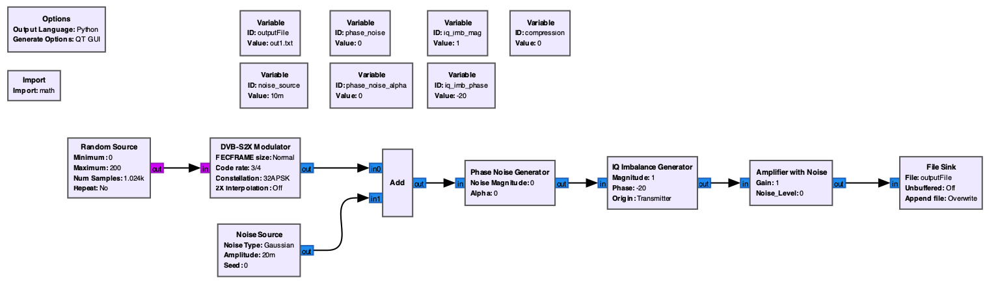

## Detecting digital RF signal impairments in IQ Constellation plots

This repository demonstrates applying a combination of statistical methods and machine learning to detect signal impairments in digital RF signals. The
solution relies on processing data in an IQ Constellation diagram. For background on digital RF signal impairments,
see the following [video](https://www.youtube.com/watch?v=aQd_zBytid8). The goal of this repository is to
demonstrate using a software approach rather than more traditional hardware solutions.
Another consideration of this solution is using methods which can scale the number of blobs in the
modulation and coding scheme, for example QPSK to 32APSK.
Lastly, the solution should be performant in terms of compute footprint to enable low cost analysis and edge deployment.

### IQ Constellation Impairment Classes

The following impairment classes are considered in this solution. Its expected that the feature engineering
process of this solution can be extended to scale for additional impairment classes such as [in-band spurs
and IQ gain imbalance](https://rahsoft.com/2022/10/16/understanding-constellation-distortions/)

|       |        |
| :-----------------------------------------: | :-----------------------------------------: |
|                Ideal - 16QAM                |               Noise (low SNR)               |
|  |  |
|                 Phase Noise                 |     Compression (amplitude gain noise)      |

### Environment Setup

The following steps will utilize a [SageMaker Notebook](https://aws.amazon.com/sagemaker/notebooks/) as it provides a single interface
for us to both run [Jupyter Notebook](https://jupyter.org/) files and build [Docker Containers](https://www.docker.com/resources/what-container/).

We create a Notebook Instance with the following settings.


Once the infrastructure is provisioned, we can **Open JupyterLab**.

### Generating Data

Given the solution relies on statistics and machine learning, we need to generate data to train on.
For this task, we'll look to [GNURadio](https://www.gnuradio.org/), a popular open-source software radio ecosystem.

A Docker image is used to run a GNU Radio flowgraph in a headless environment.
The flowgraph uses a [DVB-S2X](https://en.wikipedia.org/wiki/DVB-S2X) modulator to create IQ constellation plots
and save to a file. Signal error is introduced in the flowgraph which can be randomly varied to simulate each of the impairment classes.
We use this flowgraph to generate a large number of samples for each of the impairment classes.
Those samples will train a Classification Machine Learning model to determine whether an impairment is present in future IQ Constellation plots.

The following flowgraph is used to generate data. Normal, Phase Noise, and Interference impairment classes are generated using GNU Radio.



Compression was not achieved using the above flowgraph and is suggested as future work.
Compression was generated using a mathematical approach for QPSK only, see [compression-generator.py](./data_generation/generator/compression-generator.py)

#### Creating the GNURadio Docker Image

Within the Jupyter environment, first open a terminal with **File -> New -> Terminal**.

Navigate to the SageMaker directory and clone this repository

```
cd SageMaker
git clone https://github.com/aws-samples/digital-rf-signal-impairment-detection.git
```

Navigate to the docker_build directory and build the container - this may take up to 5 minutes

```
cd digital-rf-signal-impairment-detection/data_generation/docker_build
docker build . -t gnuradio-image
```

#### Running Scripts

First create the directory structure to store the training data for each modulation scheme.

```
cd ../../data_generation/generator
./create_folders.sh
cd ../..
```

Enter the docker container with the following to generate low SNR noise and phase noise impairments

```
docker run -it --rm -v $PWD/data_generation:/temp/data gnuradio-image
```

Now, within the container, run the following to generate compression (amplifier gain errors) files
(QPSK only at this time)

```
cd /temp/data/generator
python generator.py
for i in {1..100}; do python compression-generator.py; done; echo "Generation Complete"
```

We can exit the container. We now have training data located at
_digital-rf-signal-impairment-detection/data_generation/generator/data_

```
exit
```

### Preprocessing

The approach for solving impairment classification first relies on feature engineering using a statistical approach.
If we consider the following constellation plot, we note 32 blobs which represent 32APSK modulation and coding.
We first apply [K-Means Clustering](https://scikit-learn.org/stable/modules/generated/sklearn.cluster.KMeans.html)
to detect each of the blobs within the data sample.
Its assumed we know the number of blobs ahead of time, although a future enhancement is to design without this assumption,
in order to handle the typical Satellite Communications use-case of ACM (Adaptive Coding & Modulation).
Given each blob, we apply the Covariance Error Ellipse which tells us the [eccentricity](<https://en.wikipedia.org/wiki/Eccentricity_(mathematics)>).
Further, the density, rotation, and ratio of major/minor axis of the ellipse can be extracted as features and recorded into
a tabular data format.


We can see the result of applying K-Means Clustering, Covariance Error Ellipse, and solving for metrics like density, rotation,
and ratio of major to minor axis.
Note, color coding of the individual blobs, ellipse boundaries, and color coded major and minor ellipse axes.


Run the [IQ-data-pre-process.ipynb](./notebooks/IQ-data-pre-process.ipynb) notebook to execute the preprocessing stage.

### Training

We use the [Autogluon](https://auto.gluon.ai/) library to train a tabular classifier on the features which
have been extracted during the preprocessing step.
Autogluon will train multiple models based on the training data, with metrics describing model performance.
Autogluon will automatically use the model with the highest performance and lowest inference latency.


Run the [IQ-data-train-classifier.ipynb](./notebooks/IQ-data-train-classifier.ipynb) notebook to execute the training stage.

### Inference

We can load the Autogluon model and run inference on sample IQ Constellation plots in the _inference/_ folder.
This will yield results of either Normal, Phase Noise, Compression, or Interference per IQ modulation. Those inference insights will be published to an [Amazon Simple Storage Service (S3)](https://aws.amazon.com/s3/) bucket.

Run the [IQ-data-process-inference.ipynb](./notebooks/IQ-data-process-inference.ipynb) notebook to execute the preprocessing stage.

### Summary

This repository demonstrates applying statistical and machine learning methods to detect digital RF signal impairments in IQ Constellation diagrams. The solution is designed with compute efficiency in mind to enable cost effective inference or edge deployment scenarios. Inference results are published to an S3 bucket to enable alerting and downstream analytics.

### Future Improvements

The following items are recognized as improvements to this solution:

- Use GNU Radio to simulate compression and additional impairment classes
- Enhance the feature engineering process to accommodate additional classes like in-band spurs
  and IQ gain imbalance
- Compare results of this solution against deep learning or computer vision alternatives

### Known Issues

The following issues are recognized:

- Running the generator in the docker container results in warnings which does not impact the data generation process
- Ensure the _docker run_ command is run from the root of the repo so the _data_generation/_ folder mounts properly with the _-v_ flag

## Security

See [CONTRIBUTING](CONTRIBUTING.md#security-issue-notifications) for more information.

## License

This library is licensed under the MIT-0 License. See the LICENSE file.
