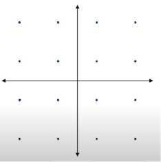
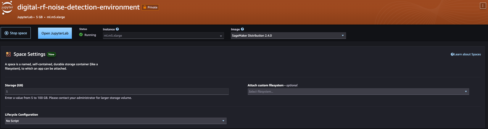

## Detecting digital RF signal impairments in IQ Constellation plots

This repository demonstrates applying a combination of statistical methods and machine learning to detect signal impairments in digital RF signals. The
solution relies on processing data in an IQ Constellation diagram. For background on digital RF signal impairments,
see the following [video](https://www.youtube.com/watch?v=aQd_zBytid8). The goal of this repository is to
demonstrate using a software approach rather than more traditional hardware solutions.
Another consideration of this solution is using methods which can scale the number of blobs in the
modulation and coding scheme, for example [QPSK](<https://en.wikipedia.org/wiki/Phase-shift_keying#Quadrature_phase-shift_keying_(QPSK)>) to 32APSK.
Lastly, the solution should be performant in terms of compute footprint to enable low cost analysis and edge deployment.

### IQ Constellation Impairment Classes

The following impairment classes are considered in this solution. Its expected that the feature engineering
process of this solution can be extended to scale for additional impairment classes such as [in-band spurs
and IQ gain imbalance](https://rahsoft.com/2022/10/16/understanding-constellation-distortions/)

|       |        |
| :-----------------------------------------: | :-----------------------------------------: |
|                Ideal - 16QAM                |               Noise (low SNR)               |
|  |  |
|                 Phase Noise                 |     Compression (amplitude gain noise)      |

### Environment Setup

The following steps will utilize a JupyterLab environment in [Amazon SageMaker AI](https://aws.amazon.com/sagemaker-ai/). Follow the [JupyterLab user guide](https://docs.aws.amazon.com/sagemaker/latest/dg/studio-updated-jl-user-guide.html) to setup an environment. For this test, a ml.m5.xlarge instance with 5GB of storage was selected. When the environment has a status of Running, click **Open JupyterLab**.



Within the JupyterLab environment, first open a terminal with **File -> New -> Terminal**. Clone this repository

```
git clone https://github.com/aws-samples/digital-rf-signal-impairment-detection.git
```

In the following steps, three notebooks will be utilized. They are located in the [notebooks/](https://github.com/aws-samples/digital-rf-signal-impairment-detection/tree/main/notebooks) directory of this repository.

### Preprocessing

The approach for solving impairment classification first relies on feature engineering using a statistical approach.
If we consider the following constellation plot, we note 16 blobs which represent 16APSK modulation and coding.
We first apply [K-Means Clustering](https://scikit-learn.org/stable/modules/generated/sklearn.cluster.KMeans.html)
to detect each of the blobs within the data sample.
Its assumed we know the number of blobs ahead of time, although a future enhancement is to design without this assumption,
in order to handle the typical Satellite Communications use-case of ACM (Adaptive Coding & Modulation).
Given each blob, we apply the Covariance Error Ellipse which tells us the [eccentricity](<https://en.wikipedia.org/wiki/Eccentricity_(mathematics)>).
Further, the density, rotation, and ratio of major/minor axis of the ellipse can be extracted as features and recorded into
a tabular data format.


We can see the result of applying K-Means Clustering, Covariance Error Ellipse, and solving for metrics like density, rotation,
and ratio of major to minor axis. Note, color coding of the individual blobs and ellipse boundaries.

Run the [IQ-data-pre-process.ipynb](./notebooks/IQ-data-pre-process.ipynb) notebook to execute the
preprocessing stage (Kernel -> Restart Kernel and run all cells)

### Training

Next, we use the [Autogluon](https://auto.gluon.ai/) library to train a tabular classifier on the features which
have been extracted during the preprocessing step.
Autogluon will train multiple models based on the training data, with metrics describing model performance.
Autogluon will automatically use the model with the highest performance and lowest inference latency.


Run the [IQ-data-train-classifier.ipynb](./notebooks/IQ-data-train-classifier.ipynb) notebook to execute the training stage.

### Inference

Finally, we load the Autogluon model and run inference on sample IQ Constellation plots in the [inference/](https://github.com/aws-samples/digital-rf-signal-impairment-detection/tree/main/notebooks/inference) folder.
This will yield results of either Normal, Phase Noise, Compression, or Interference per IQ modulation.
Those inference insights will be published to an [Amazon Simple Storage Service (S3)](https://aws.amazon.com/s3/) bucket.

A follow-on step could then include triggering an alarm via SNS if an abundance of particular errors were detected.

Run the [IQ-data-process-inference.ipynb](./notebooks/IQ-data-process-inference.ipynb) notebook to execute the inference stage.

### Generating New Data - Optional

The repo includes sample data in the following directory [data_generation/generator/data](https://github.com/aws-samples/digital-rf-signal-impairment-detection/tree/main/data_generation/generator/data). If you wish to generate additional samples, we'll look to [GNURadio](https://www.gnuradio.org/), a popular open-source software radio ecosystem.

A Docker image is used to run a GNU Radio flowgraph in a headless environment.
The flowgraph uses a [DVB-S2X](https://en.wikipedia.org/wiki/DVB-S2X) modulator to create IQ constellation plots
and save to a file. Signal error is introduced in the flowgraph which can be randomly varied to simulate each of the impairment classes.
We use this flowgraph to generate a large number of samples for each of the impairment classes.
Those samples will train a Multi-Classification Machine Learning model to determine whether an impairment is present in future IQ Constellation plots.

The following flowgraph is used to generate data. Normal, Phase Noise, and Interference impairment classes are generated using GNU Radio.


#### Creating the GNURadio Docker Image - Optional

Navigate to the docker_build directory and build the container - this may take up to 5 minutes

```
cd digital-rf-signal-impairment-detection/data_generation/docker_build
docker build . -t gnuradio-image
```

#### Running Data Generation Scripts - Optional

A bash script has been setup to automate the process of generating data using the gnuradio flowgraph. Navigate to the root directory of the repo and run the script

```
cd ../../
sh run_data_generation_pipeline.sh
```

Notice, the data samples is created. To modify data classes or change the number of samples created for each class see **data_generation/generator/generator.py**.

### Summary

This repository demonstrates applying statistical and machine learning methods to detect digital RF signal impairments
in IQ Constellation diagrams using AWS-Cloud. The solution is designed with compute efficiency in mind to enable
cost effective inference or edge deployment use cases.
Inference results are published to an S3 bucket to enable alerting and downstream analytics.

### Future Improvements

The following items are recognized as improvements to this solution:

- Enhance the feature engineering process to accommodate additional classes like in-band spurs
- Compare results of this solution against deep learning or computer vision alternatives
- Accomodate larger modulation schemas eg 64-APSK

### Known Issues

The following issues are recognized:

- Running the generator in the docker container results in warnings. These do not impact the data generation process
- You may need to delete the **data_generation/generator/data** directory if generating additional data samples is desired

### Cleanup

For cost optimization, the JupyterLab environment can be Started and Stopped depending on whether its being used. To cleanup resources entirely, the SageMaker JupyterLab space can be deleted.

## Security

See [CONTRIBUTING](CONTRIBUTING.md#security-issue-notifications) for more information.

## License

This library is licensed under the MIT-0 License. See the LICENSE file.
