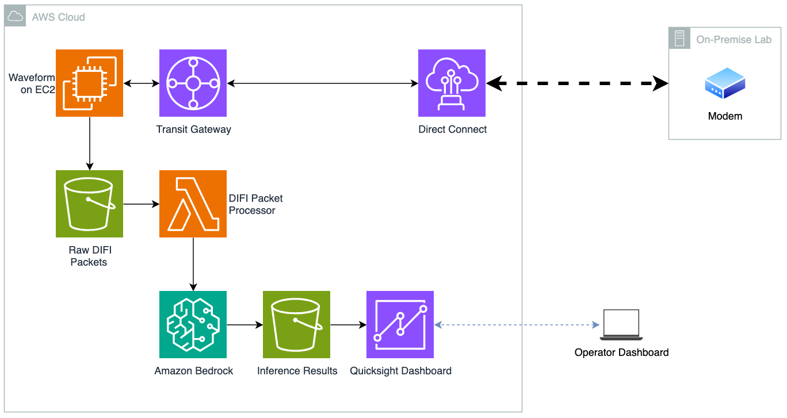

# Generative AI Solution for Digital RF Signal Impairment Detection

This solution path leverages **generative AI** to analyze constellation plots for detecting noise and impairment causes in digital RF signals. The approach combines automated DIFI packet processing with Amazon Bedrock's multimodal AI capabilities to provide intelligent signal analysis without requiring traditional machine learning model training.

## Solution Architecture

> **Note:** The waveform on EC2, networking services (Transit Gateway, Direct Connect), and the on-premise lab/modem are outside the scope of this solution. This solution focuses on the pipeline from Raw DIFI Packets (S3) through to the inference results and dashboard.

### AWS Services Used

- **Amazon S3** — Stores raw DIFI packets (input), constellation diagrams, and inference results (output)
- **AWS Lambda** — Serverless DIFI packet processor that extracts I/Q data and generates constellation plots
- **Amazon Bedrock** — Generative AI service providing multimodal analysis of constellation diagrams via Claude Sonnet 4.5

### 🔄 [DIFI_Processor](./DIFI_Processor/)

**Converts PCAP files of DIFI packets into constellation diagrams**

- **Input**: PCAP files containing Digital Intermediate Frequency Interoperability (DIFI) standard packets
- **Processing**: Serverless AWS Lambda function that extracts I/Q data from DIFI packets
- **Output**: Constellation plot images optimized for AI analysis
- **Benefits**:
  - Serverless and scalable processing
  - Event-driven S3 triggers
  - Independent compute isolation
  - Cost-effective pay-per-use model

### 🧠 [Bedrock_Insights](./Bedrock_Insights/)

**Uses Amazon Bedrock generative AI to analyze constellation plots**

- **Input**: Constellation diagram images from DIFI_Processor
- **Processing**: Amazon Bedrock Agent with Claude Sonnet 4.5 multimodal LLM
- **Output**: Intelligent analysis of signal impairments, causes, and recommendations
- **Benefits**:
  - No model training required
  - Few-shot learning with example images
  - Knowledge base integration (RAG)
  - Natural language explanations

## Key Advantages of the Generative AI Approach

### 🚀 **No Training Required**

Unlike traditional machine learning approaches, this solution uses pre-trained generative AI models that can analyze constellation plots immediately without requiring:

- Large training datasets
- Model development and tuning
- Specialized ML expertise
- Compute-intensive training processes

### 🎯 **Few-Shot Learning**

The system uses few-shot prompting with example constellation images to guide the AI model's analysis, enabling accurate impairment detection with minimal setup.

### 📚 **Knowledge Base Integration**

Retrieval Augmented Generation (RAG) enhances analysis by incorporating technical documentation about RF impairments, providing contextual and accurate explanations.

### 🔍 **Multimodal Analysis**

Claude Sonnet 4.5's vision capabilities enable direct analysis of constellation plot images, identifying patterns that indicate specific impairments like:

- Phase noise (rotational smearing)
- Interference (random scattering)
- Compression (amplitude distortion)
- Normal signal characteristics

## Comparison with Traditional ML Approach

| Aspect                | Generative AI Solution    | Traditional ML Solution        |
| --------------------- | ------------------------- | ------------------------------ |
| **Setup Time**        | Minutes (no training)     | Hours/Days (requires training) |
| **Data Requirements** | Few examples              | Large labeled datasets         |
| **Expertise Needed**  | Basic AWS knowledge       | ML/Data science expertise      |
| **Scalability**       | Immediate                 | Requires model retraining      |
| **Explanations**      | Natural language insights | Statistical metrics only       |
| **Adaptability**      | Easy prompt modifications | Model retraining required      |

## Use Cases

### 🛰️ **Satellite Communications**

- Real-time analysis of satellite downlink signals
- Automated impairment detection in ground stations
- Quality monitoring for adaptive coding and modulation (ACM)

### 📡 **RF System Monitoring**

- Continuous monitoring of RF equipment performance
- Predictive maintenance based on signal quality trends
- Troubleshooting support with AI-generated explanations

### 🔬 **Research and Development**

- Rapid prototyping of signal analysis workflows
- Educational tools for RF engineering training
- Comparative analysis of different impairment mitigation techniques

## Technical Benefits

### **Serverless Architecture**

- **Cost Efficiency**: Pay only for actual processing time
- **Automatic Scaling**: Handle varying workloads without infrastructure management
- **High Availability**: Built-in redundancy and fault tolerance

### **AI-Powered Insights**

- **Contextual Analysis**: Understanding of RF domain knowledge
- **Pattern Recognition**: Advanced visual analysis of constellation patterns
- **Natural Language Output**: Human-readable explanations and recommendations

### **Integration Ready**

- **Event-Driven**: Automatic processing triggered by file uploads
- **API Access**: Programmatic access to analysis results
- **Extensible**: Easy to add new impairment types or analysis features

## Future Enhancements

- **Multi-Modal Analysis**: Combine constellation plots with spectral analysis
- **Temporal Analysis**: Track signal quality changes over time
- **Automated Alerting**: Integration with monitoring and alerting systems
- **Custom Knowledge Bases**: Domain-specific technical documentation integration
- **Advanced Visualizations**: Interactive analysis dashboards

## Support and Documentation

- **DIFI_Processor**: See [DIFI_Processor/README.md](./DIFI_Processor/README.md) for detailed setup and usage
- **Bedrock_Insights**: See [Bedrock_Insights/README.md](./Bedrock_Insights/README.md) for AI configuration and deployment
- **Supervised Learning**: See [Supervised Learning README](../supervised_learning/README.md) for the traditional ML approach
- **AWS Documentation**: [Amazon Bedrock User Guide](https://docs.aws.amazon.com/bedrock/)
- **DIFI Standard**: [Digital IF Interoperability Consortium](https://dificonsortium.org/)

## License

This library is licensed under the MIT-0 License. See the [LICENSE](../LICENSE) file.
