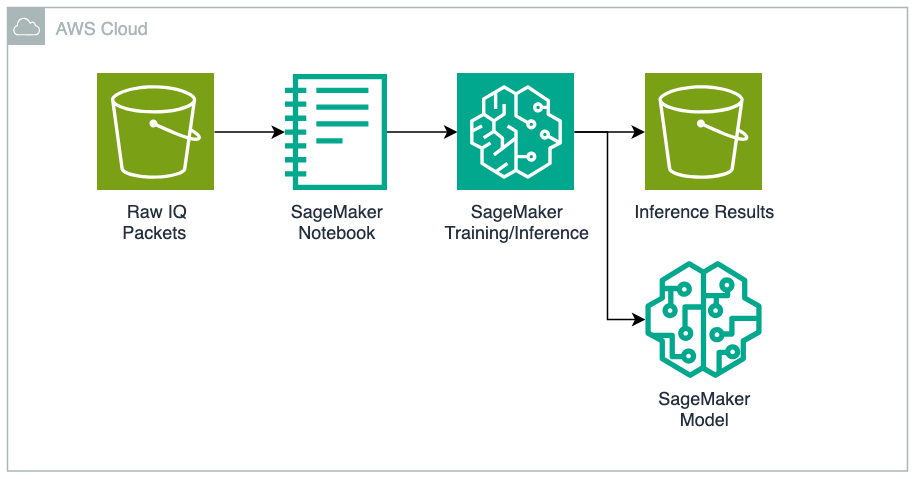

# Solution Path 1: Supervised Learning for Digital RF Signal Impairment Detection

This solution path applies statistical feature engineering and supervised machine learning to detect signal impairments in digital RF signals. IQ constellation data is processed through K-Means clustering and covariance error ellipse analysis to extract features, which are then used to train a multi-class classifier using [AutoGluon](https://auto.gluon.ai/). For background on digital RF signal impairments, see the following [video](https://www.youtube.com/watch?v=aQd_zBytid8).

## IQ Constellation Impairment Classes

The following impairment classes are considered in this solution. The feature engineering process can be extended to accommodate additional impairment classes such as [in-band spurs and IQ gain imbalance](https://rahsoft.com/2022/10/16/understanding-constellation-distortions/).

|       |        |
| :-----------------------------------------: | :-----------------------------------------: |
|                Ideal - 16QAM                |               Noise (low SNR)               |
|  |  |
|                 Phase Noise                 |     Compression (amplitude gain noise)      |

## Solution Approach

### Preprocessing — Feature Engineering

The approach for solving impairment classification relies on feature engineering using statistical methods. Given a constellation plot, we note blobs which represent the modulation and coding scheme (e.g., 16 blobs for 16APSK). We first apply [K-Means Clustering](https://scikit-learn.org/stable/modules/generated/sklearn.cluster.KMeans.html) to detect each of the blobs within the data sample. It is assumed we know the number of blobs ahead of time, although a future enhancement is to design without this assumption to handle the typical Satellite Communications use-case of ACM (Adaptive Coding & Modulation).

Given each blob, we apply the Covariance Error Ellipse which tells us the [eccentricity](https://en.wikipedia.org/wiki/Eccentricity_(mathematics)). The density, rotation, and ratio of major/minor axis of the ellipse can then be extracted as features and recorded into a tabular data format.


The result of applying K-Means Clustering, Covariance Error Ellipse, and solving for metrics like density, rotation, and ratio of major to minor axis. Note the color coding of individual blobs and ellipse boundaries.

### Training — AutoGluon Classifier

Next, we use the [AutoGluon](https://auto.gluon.ai/) library to train a tabular classifier on the features extracted during preprocessing. AutoGluon trains multiple models based on the training data, with metrics describing model performance. It automatically selects the model with the highest performance and lowest inference latency.


### Inference — Classification & Alerting

Finally, we load the trained AutoGluon model and run inference on new IQ constellation plots. This yields a classification of either Normal, Phase Noise, Compression, or Interference per IQ modulation. Inference results are published to an [Amazon S3](https://aws.amazon.com/s3/) bucket, where a follow-on step could trigger an alarm via SNS if an abundance of particular errors were detected.

## Solution Architecture on AWS



### AWS Services Used

- **Amazon S3** — Stores raw IQ packet data (input) and inference results (output)
- **Amazon SageMaker Notebook** — JupyterLab environment for feature engineering, training, and inference
- **Amazon SageMaker Training/Inference** — Runs AutoGluon model training and inference workloads
- **Amazon SageMaker Model** — Persists the trained classifier for reuse

## Getting Started

### Environment Setup

The following steps utilize a JupyterLab environment in [Amazon SageMaker AI](https://aws.amazon.com/sagemaker-ai/). Follow the [JupyterLab user guide](https://docs.aws.amazon.com/sagemaker/latest/dg/studio-updated-jl-user-guide.html) to set up an environment. For this test, a ml.m5.xlarge instance with 5GB of storage was selected.


Within JupyterLab, open a terminal with **File -> New -> Terminal** and clone the repository:

```bash
git clone https://github.com/aws-samples/digital-rf-signal-impairment-detection.git
```

The notebooks are located in the [notebooks/](./notebooks/) directory.

### Step 1: Preprocessing

Run the [IQ-data-pre-process.ipynb](./notebooks/IQ-data-pre-process.ipynb) notebook (Kernel -> Restart Kernel and run all cells).

Much of the processing logic is in [utility/constellation_metrics.py](./notebooks/utility/constellation_metrics.py).

### Step 2: Training

Run the [IQ-data-train-classifier.ipynb](./notebooks/IQ-data-train-classifier.ipynb) notebook.

### Step 3: Inference

Run the [IQ-data-process-inference.ipynb](./notebooks/IQ-data-process-inference.ipynb) notebook. Sample test data is available in the [inference/](./notebooks/inference/) folder.

## Generating New Data (Optional)

The repo includes sample data in [data_generation/generator/data](./data_generation/generator/data). If you wish to generate additional samples, we use [GNU Radio](https://www.gnuradio.org/), a popular open-source software radio ecosystem.

A Docker image runs a GNU Radio flowgraph in a headless environment. The flowgraph uses a [DVB-S2X](https://en.wikipedia.org/wiki/DVB-S2X) modulator to create IQ constellation plots and save to a file. Signal error is introduced in the flowgraph which can be randomly varied to simulate each of the impairment classes. We use this flowgraph to generate a large number of samples for each impairment class to train the multi-classification model.


### Build the Docker Image

```bash
cd data_generation/docker_build
docker build . -t gnuradio-image
```

### Run Data Generation

From the `supervised_learning/` directory:

```bash
sh run_data_generation_pipeline.sh
```

To modify data classes or sample counts, see `data_generation/generator/generator.py`.

## Project Structure

```
supervised_learning/
├── README.md
├── run_data_generation_pipeline.sh
├── notebooks/
│   ├── IQ-data-pre-process.ipynb        # Feature engineering
│   ├── IQ-data-train-classifier.ipynb   # Model training
│   ├── IQ-data-process-inference.ipynb  # Inference & S3 output
│   ├── utility/
│   │   ├── constellation_metrics.py     # K-Means + ellipse processing
│   │   └── utility.py                   # Confidence ellipse math
│   └── inference/                       # Sample test data
├── data_generation/
│   ├── generator/
│   │   ├── generator.py                 # GNU Radio data generator
│   │   ├── process.py                   # Post-processing
│   │   └── data/                        # Generated IQ data
│   └── docker_build/                    # GNU Radio Docker image
└── repository_images/                   # Documentation images
```

## Known Issues

- Running the generator in the Docker container produces warnings that do not impact data generation
- You may need to delete `data_generation/generator/data` before generating additional samples

## Cleanup

The SageMaker JupyterLab space can be stopped when not in use and deleted to remove all resources.

## License

This library is licensed under the MIT-0 License. See the [LICENSE](../LICENSE) file.
