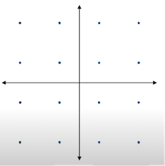
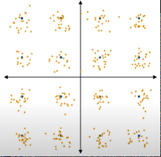
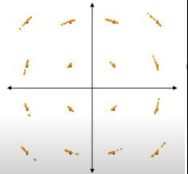
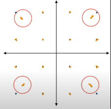
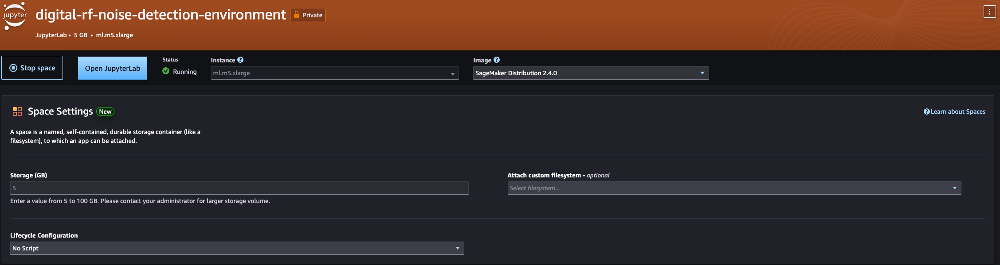
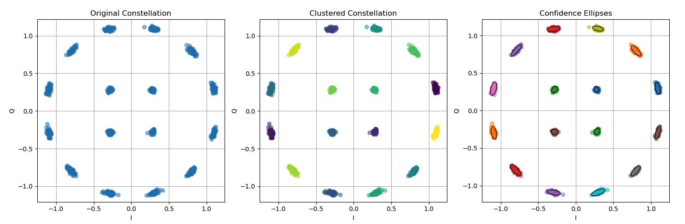
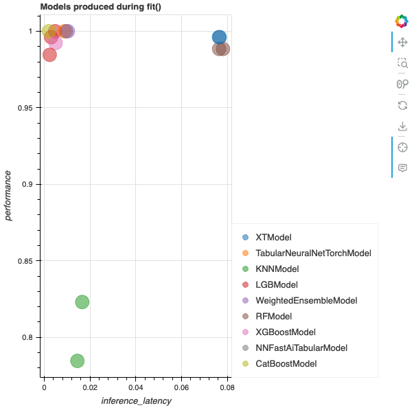
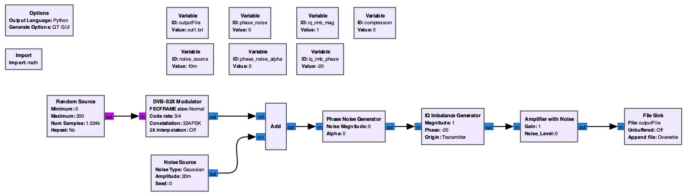

# Solution Path 1: Supervised Learning for Digital RF Signal Impairment Detection

This solution path applies statistical feature engineering and supervised machine learning to detect signal impairments in digital RF signals. IQ constellation data is processed through K-Means clustering and covariance error ellipse analysis to extract features, which are then used to train a multi-class classifier using [AutoGluon](https://auto.gluon.ai/).

## Solution Architecture

```
IQ Data (CSV) → Feature Engineering → AutoGluon Training → Classifier Model → Inference → S3 Notifications
```

### Pipeline Overview

1. **Preprocessing** — K-Means clustering maps constellation blobs to clusters, then covariance error ellipses extract features like density, rotation, and axis ratio into tabular format
2. **Training** — AutoGluon trains multiple classifier models and automatically selects the best performer
3. **Inference** — The trained model classifies new IQ constellation plots and publishes results to S3

## IQ Constellation Impairment Classes

|       |        |
| :-----------------------------------------: | :-----------------------------------------: |
|                Ideal - 16QAM                |               Noise (low SNR)               |
|  |  |
|                 Phase Noise                 |     Compression (amplitude gain noise)      |

## Environment Setup

The following steps utilize a JupyterLab environment in [Amazon SageMaker AI](https://aws.amazon.com/sagemaker-ai/). Follow the [JupyterLab user guide](https://docs.aws.amazon.com/sagemaker/latest/dg/studio-updated-jl-user-guide.html) to set up an environment. For this test, a ml.m5.xlarge instance with 5GB of storage was selected.



Within JupyterLab, open a terminal with **File -> New -> Terminal** and clone the repository:

```bash
git clone https://github.com/aws-samples/digital-rf-signal-impairment-detection.git
```

The notebooks are located in the [notebooks/](./notebooks/) directory.

## Step 1: Preprocessing

The approach relies on feature engineering using statistical methods. Given a constellation plot, we apply [K-Means Clustering](https://scikit-learn.org/stable/modules/generated/sklearn.cluster.KMeans.html) to detect each blob. Then we apply the Covariance Error Ellipse to extract the [eccentricity](https://en.wikipedia.org/wiki/Eccentricity_(mathematics)), density, rotation, and ratio of major/minor axis as features in tabular format.



Run the [IQ-data-pre-process.ipynb](./notebooks/IQ-data-pre-process.ipynb) notebook (Kernel -> Restart Kernel and run all cells).

## Step 2: Training

AutoGluon trains multiple models on the extracted features and automatically selects the model with the highest performance and lowest inference latency.



Run the [IQ-data-train-classifier.ipynb](./notebooks/IQ-data-train-classifier.ipynb) notebook.

## Step 3: Inference

Load the AutoGluon model and run inference on sample IQ constellation plots in the [inference/](./notebooks/inference/) folder. Results are classified as Normal, Phase Noise, Compression, or Interference and published to an [Amazon S3](https://aws.amazon.com/s3/) bucket.

Run the [IQ-data-process-inference.ipynb](./notebooks/IQ-data-process-inference.ipynb) notebook.

## Generating New Data (Optional)

Sample data is included in [data_generation/generator/data](./data_generation/generator/data). To generate additional samples using [GNU Radio](https://www.gnuradio.org/):

### Build the Docker Image

```bash
cd data_generation/docker_build
docker build . -t gnuradio-image
```

### Run Data Generation

From the `supervised_learning/` directory:

```bash
sh run_data_generation_pipeline.sh
```

To modify data classes or sample counts, see `data_generation/generator/generator.py`.



## Project Structure

```
supervised_learning/
├── README.md
├── run_data_generation_pipeline.sh
├── notebooks/
│   ├── IQ-data-pre-process.ipynb        # Feature engineering
│   ├── IQ-data-train-classifier.ipynb   # Model training
│   ├── IQ-data-process-inference.ipynb  # Inference & S3 output
│   ├── utility/
│   │   ├── constellation_metrics.py     # K-Means + ellipse processing
│   │   └── utility.py                   # Confidence ellipse math
│   └── inference/                       # Sample test data
├── data_generation/
│   ├── generator/
│   │   ├── generator.py                 # GNU Radio data generator
│   │   ├── process.py                   # Post-processing
│   │   └── data/                        # Generated IQ data
│   └── docker_build/                    # GNU Radio Docker image
└── repository_images/                   # Documentation images
```

## Known Issues

- Running the generator in the Docker container produces warnings that do not impact data generation
- You may need to delete `data_generation/generator/data` before generating additional samples

## Cleanup

The SageMaker JupyterLab space can be stopped when not in use and deleted to remove all resources.

## License

This library is licensed under the MIT-0 License. See the [LICENSE](../LICENSE) file.
